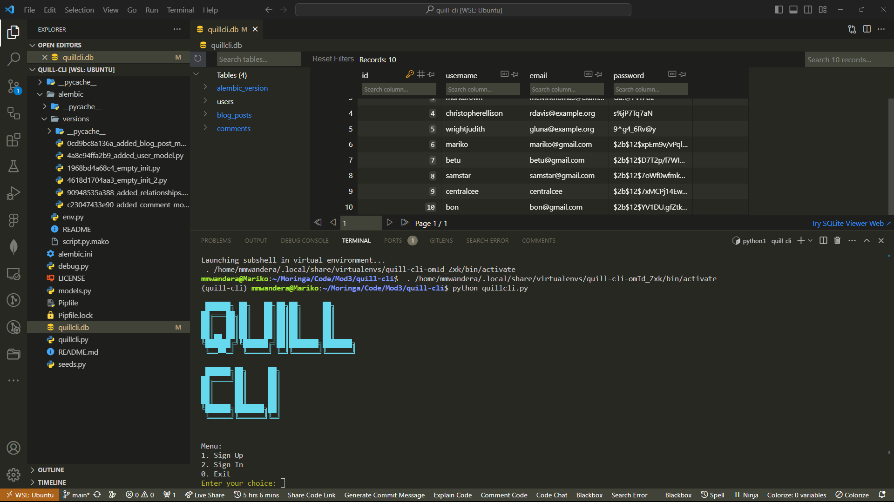

# QuillCLI

## Overview:
QuillCLI is a command-line interface (CLI) application for managing blog posts. It allows users to sign up, sign in, create, view, and delete blog posts, as well as add and view comments. The application is built using Python and SQLAlchemy, providing a simple and interactive way to interact with a blog system.



### Prerequisites

- Python 3
- Pipenv (install using `pip install pipenv`)

## Getting Started

Follow these instructions to get a copy of the project up and running on your local machine.

1. **Fork the repository:**

   Click the "Fork" button at the top right corner of this repository to create your copy.

2. **Clone the repository:**

    After copying the SSH link provided by pressing code on this repositry, run this on your terminal:

   ```git clone https://github.com/your-username/quill-cli.git```

    Open the folder on your VSCode or preferred IDE

3. **Install dependencies:**

    ```pipenv install```

4. **Usage:**

    ```python quillcli.py```

### License
This project is licensed under the MIT License - see the LICENSE file for details.

### Acknowledgments

* PrettyTable - For creating ASCII tables.
* Passlib - For secure password hashing.
* SQLAlchemy - For SQL toolkit and Object-Relational Mapping (ORM).
